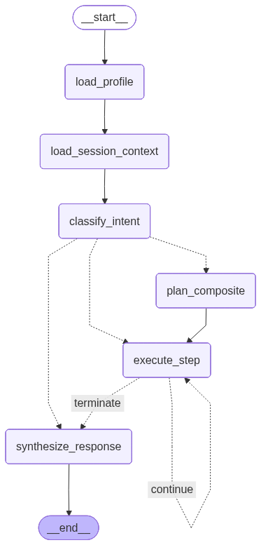
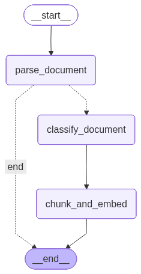
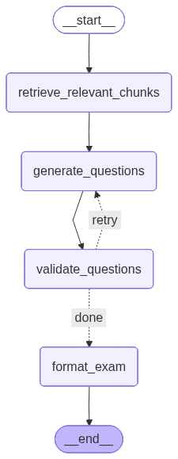
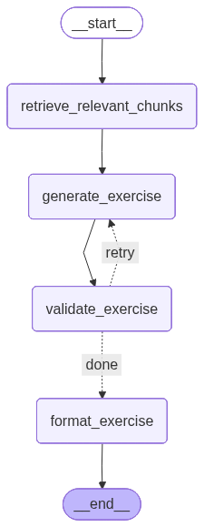
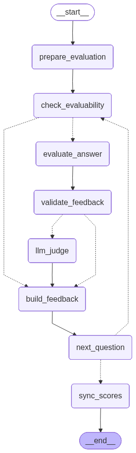
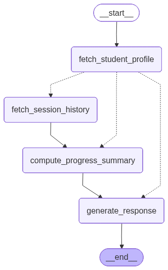
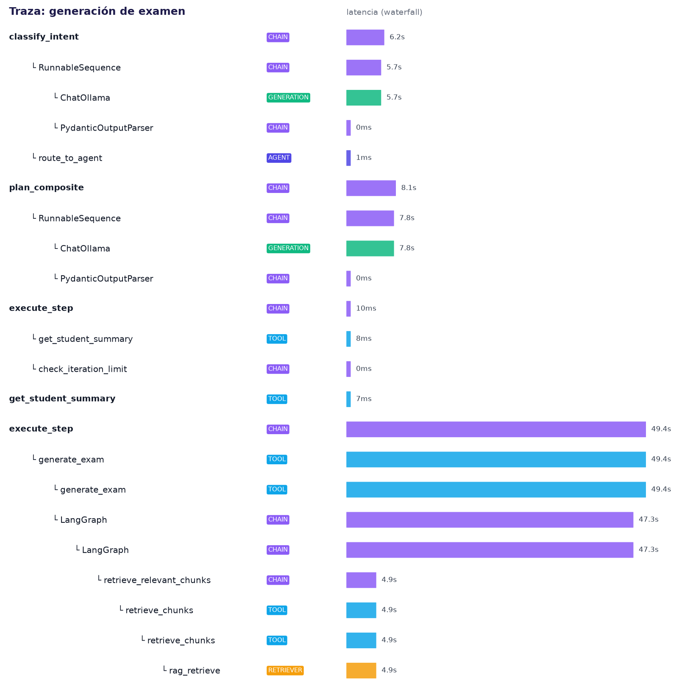

# Tutor Académico Personal — Defensa Final

**Trabajo Práctico N°2 · Inteligencia Artificial 2026 · UTN Santa Fe — CIDISI**
**Entrega Final · 29/06/2026**

> Slide deck en Markdown. Convertir a PowerPoint/Google Slides para la defensa.
> Cada `---` es un slide nuevo. Los diagramas referencian `docs/presentation/assets/`.

---

## Slide 1 — Título

# Tutor Académico Personal

### Sistema Multi-Agente LLM para Estudio Adaptativo

**Integrantes**: [Nombre 1] · [Nombre 2] · [Nombre 3]
**Trabajo Práctico N°2** · Inteligencia Artificial 2026
UTN Santa Fe — CIDISI

---

## Slide 2 — Problema

# El problema

### El estudio universitario es pasivo

| Estudiante HOY | Con nuestro sistema |
|---|---|
| Lee apuntes sin feedback | **Genera** exámenes personalizados |
| No sabe qué no sabe | **Resuelve** y recibe corrección |
| Repite temas ya dominados | **Prioriza** temas débiles |
| Estudia solo | **Agente** que acompaña el proceso |

> Ciclo activo: **generación → resolución → corrección → retroalimentación**

---

## Slide 3 — Taxonomía del Agente

# Ambiente del Agente

### Clasificación según Russell & Norvig

| Dimensión | Clasificación |
|---|---|
| Observabilidad | **Parcialmente observable** — no conoce estado cognitivo real |
| Agentes | **Multi-agente cooperativo** — 6 agentes coordinados |
| Determinismo | **Estocástico** — respuestas del LLM no deterministas |
| Episodicidad | **Semi-episódico** — estado persiste entre sesiones |
| Dinamismo | **Dinámico** — conocimiento evoluciona |
| Continuidad | **Discreto** — interacciones por turnos |

---

## Slide 4 — Arquitectura

# Arquitectura del Sistema

```
┌─────────────────────────────────────────────────────────┐
│  UI · Next.js + React + Tailwind                        │
│  Chat · Upload · Dashboard · Exam Renderer              │
├─────────────────────────────────────────────────────────┤
│  ORQUESTACIÓN · LangGraph (Python)                      │
│                                                         │
│     ┌───────────┐                                       │
│     │Orchestrator│── Plan-and-Execute                    │
│     └─────┬─────┘                                       │
│    ┌──────┼──────┬──────────┬──────────┐               │
│    ▼      ▼      ▼          ▼          ▼               │
│  Ingestor  ExamGen  ExerciseGen  Evaluator  Support    │
│  (ReAct)   (ReAct)  (ReAct)     (CoT)      (Reactive)  │
├─────────────────────────────────────────────────────────┤
│  DATOS · ChromaDB (vectorial) + SQLite (perfil)         │
│  Langfuse (observabilidad)                              │
└─────────────────────────────────────────────────────────┘
```

---

## Slide 5 — Stack Tecnológico

# Stack Tecnológico

| Capa | Tecnología | Por qué |
|---|---|---|
| **LLM** | Ollama Cloud `gemma4:31b-cloud` | Tool calling nativo, español, local/cloud |
| **Orquestación** | LangGraph + LangChain | StateGraph con conditional edges y loops |
| **RAG** | ChromaDB + `paraphrase-multilingual-MiniLM-L12-v2` | Vector store local, embeddings multilingües |
| **API** | FastAPI (Python) | Async, tipado, OpenAPI automático |
| **UI** | Next.js 15 + React 19 + Tailwind 4 | SPA moderna, upload, chat, dashboard |
| **Memoria** | SQLite (perfil) + ChromaDB (material) | Sin servidor externo |
| **Observabilidad** | Langfuse (cloud) | Trazas estructuradas, spans anidados |

---

## Slide 6 — 6 Agentes

# 6 Agentes Especializados

| Agente | Loop | Responsabilidad |
|---|---|---|
| **Orchestrator** | Plan-and-Execute | Clasifica intención, enruta, planifica tareas compuestas |
| **Ingestor** | ReAct | Parsea PDFs, clasifica, genera índice temático, chunks + embeddings |
| **ExamGenerator** | ReAct + Tools | Genera exámenes MCQ + abiertas anclados en el material |
| **ExerciseGenerator** | ReAct + Tools | Genera ejercicios prácticos con solución modelo |
| **Evaluator** | Chain-of-Thought | Corrige respuestas, detecta errores conceptuales, sugiere repaso |
| **Support** | Reactive | Perfil de estudiante, dashboard, priorización de temas débiles |

---

## Slide 7 — 8 Tools

# 8 Tools — Percepciones y Acciones

| Tool | Agente | Acción |
|---|---|---|
| `ingest_document` | Ingestor | Parsea, clasifica, indexa en RAG |
| `retrieve_chunks` | Todos | Búsqueda semántica en ChromaDB (top-K) |
| `generate_exam` | ExamGenerator | Crea examen con MCQ + preguntas abiertas |
| `generate_exercise` | ExerciseGenerator | Genera ejercicio práctico multi-paso |
| `evaluate_answer` | Evaluator | Corrige respuesta libre, score 0-10, feedback |
| `update_student_profile` | Support | Actualiza scores, preferencias, temas débiles |
| `get_student_summary` | Support | Recupera perfil completo para personalizar |

---

## Slide 8 — Pipeline RAG

# Retrieval-Augmented Generation

**Write path**:
```
  PDF/TXT
    │
    ▼
┌──────────┐    ┌──────────────────┐    ┌─────────────────┐
│ markitdown│───▶│ Chunking Semántico│───▶│ Embeddings      │
│+dehyphen. │    │markdown-aware,   │    │MiniLM-L12-v2    │
│           │    │512 chars, 64 ov  │    │(384-dim, local) │
└──────────┘    │separadores jerárq│    └──────┬──────────┘
                │(\n\n##→\n\n→\n→.)│           │
                └──────────────────┘           ▼
                                         ┌─────────────┐
                                         │  ChromaDB    │
                                         │(cosine dist.)│
                                         └──────┬──────┘
                                                │
                     ┌──────────────────────────┘
                     ▼
             ┌──────────────┐
             │ Retrieve      │──▶ LLM ──▶ Examen / Ejercicio
             │Query enriquec.│
             └──────────────┘
```

**Read path — Query enrichment jerárquico**:
1. LLM matchea tema del usuario → temas de la sesión (fuzzy matching)
2. Obtiene descripción del tema matcheado (vocabulario del texto fuente)
3. Árbol temático enriquece query: padre + hijos + hermanos
4. Zero llamadas LLM extra en query-time

**Chunking semántico markdown-aware** (Epic 15): dehyphenation pre-procesa guiones de PDF. Separadores jerárquicos preservan headings y párrafos.
**Índice temático**: 3 niveles, 30 temas con descripciones. Fusión incremental con `ThematicIndex.merge()`.

---

## Slide 9 — Guardrails

# Guardrails Anti-Alucinación

| Riesgo | Guardrail | Acción |
|---|---|---|
| **Preguntas inventadas** | Validación claim-level contra ChromaDB (threshold 0.55) | Regenerar hasta 3×, luego skip |
| **Loop infinito** | Máximo 15 iteraciones por task | Terminar y devolver parcial |
| **Material no académico** | Clasificador del Ingestor | Rechazar, no contaminar BD |
| **Evaluación inconsistente** | LLM-as-judge: segundo LLM re-evalúa 30% de correcciones | Discrepancia >2pts → `requires_review` (nunca reemplaza score) |

> **Speaker note — Cómo funciona LLM-as-judge**: El Evaluator primario corrige (score 0-10 + justificación). El nodo `validate_feedback` muestrea aleatoriamente el 30% (`judge_sample_rate = 0.30`) activando `judge_sample = True`. El nodo `llm_judge` hace una llamada LLM INDEPENDIENTE con el mismo contexto (pregunta, respuesta base, respuesta estudiante, chunks RAG, evaluación primaria) pero SIN ver el prompt del Evaluator — es una segunda opinión ciega. Produce `JudgeVerdict` (score propio, agrees_with_primary, discrepancy). Si `|primary.score - judge.score| > 2.0` → `requires_review = True`. El juez audita, no corrige.

---

## Slide 10 — Memoria

# Tres Tipos de Memoria

| Tipo | Dónde | Qué guarda |
|---|---|---|
| **Short-term** | Context window + `messages_history` | Últimos 6 mensajes de la conversación |
| **Long-term** | SQLite | Scores por tema, preferencias, historial entre sesiones |
| **Episódica** | ChromaDB | Chunks del material ingestado con metadata |

**Flujo de personalización**:
`get_student_summary` → weak_topics → priorizar en generación → `update_student_profile`

---

## Slide 11 — Grafos Reales: Orchestrator

# Grafo Real — Orchestrator



**7 nodos**: `load_profile → load_session_context → classify_intent → plan_composite / execute_step / synthesize_response`

- `classify_intent`: 8 intents con confidence score
- `route_to_agent`: conditional edges → specialized agent
- `plan_composite`: LLM planner descompone tareas multi-paso
- `execute_step`: loop con retry y límite de iteraciones

> Renderizado del código real — `build_orchestrator().compile().get_graph()`

---

## Slide 12 — Grafos Reales: Ingestor + Generadores

# Grafos Reales — Ingestor, ExamGenerator, ExerciseGenerator

| Ingestor | ExamGenerator | ExerciseGenerator |
|---|---|---|
|  |  |  |
| **Lineal**: parse → classify → chunk+embed | **Retry loop**: retrieve → generate → validate → format | **Retry loop**: retrieve → generate → validate → format |

---

## Slide 13 — Grafos Reales: Evaluator + Support

# Grafos Reales — Evaluator y Support

| Evaluator | Support |
|---|---|
|  |  |
| **8 nodos**: check_evaluability → evaluate → validate → llm_judge (30% sample) → build_feedback → loop | **4 nodos**: fetch profile → fetch history → compute → respond. Salta historia si alumno nuevo |

---

## Slide 14 — VIDEO: Composite Plan-and-Execute

# 🎥 Caso Complejo — Composite Plan-and-Execute

### " Ingesta de PDFS y Generame un examen de 5 preguntas sobre agentes inteligentes y también un ejercicio práctico sobre racionalidad en agentes."

**Flujo interno**:
```
classify_intent → composite (confidence 0.92)
  → plan_composite → ["generate_exam", "generate_exercise"]
    → execute_step[0] → ExamGenerator (retrieve → generate → validate)
    → execute_step[1] → ExerciseGenerator (retrieve → generate → validate)
      → synthesize_response
```

**30+ spans en Langfuse. 2 agentes, 8 tool calls. 0 errores.**

> ▶ Reproducir video (8 min)

---

## Slide 15 — Langfuse: Traza Real

# Observabilidad — Langfuse



**Jerarquía de spans**:
```
Session
 ├── LLM Call (classify_intent)
 ├── LLM Call (plan_composite)
  ├── Tool Call (generate_exam)
  │   ├── LLM Topic Matching (match_user_topics_to_session)
  │   ├── RAG Retrieval (retrieve_chunks × 5 · topic_descriptions + topic_tree)
 │   ├── LLM Call (ChatOllama · structured output)
 │   └── Tool Call (validate_claim_grounding × 10)
 ├── Tool Call (generate_exercise)
 │   └── ...
 └── LLM Call (synthesize_response)
```

**Métricas**: tokens, latencia por span, costo, tasa de éxito de tools

---

## Slide 16 — DEMO EN VIVO

# 🔴 Demo en Vivo

### Flujo completo a través de la UI

1. **Ingesta** — Arrastrar PDF → clasifica, indexa, 30 temas con descripciones, ~25 chunks
2. **Examen** — "Generame un examen de 5 preguntas sobre agentes inteligentes"
3. **Ejercicio** — "Generame un ejercicio práctico sobre racionalidad"
4. **Evaluación** — Responder examen → scores + feedback + errores conceptuales
5. **Dashboard** — Ver progreso, temas débiles, evolución

> Cambiar a pantalla compartida — navegador (UI) + Langfuse (trazas)

---

## Slide 17 — Suite de Pruebas

# Evaluación del Sistema

### 615 tests · 12 casos PRD §8

| Categoría | Casos | Tipo de validación |
|---|---|---|
| **Happy Path** (5) | Ingesta, examen, evaluación, priorización, incremental | Determinística + LLM-as-judge |
| **Edge Cases** (2) | Tema ausente, respuesta parcial | Determinística |
| **Adversarial** (3) | Archivo no académico, tema externo, idioma distinto | Determinística |

**583 unit tests** (mock, <5s) + **32 integration tests** (LLM real)
**6 E2E live tests** (Playwright, UI completa)

---

## Slide 18 — Cobertura de Tests

# Cobertura PRD → Tests

| PRD | Descripción | Unit Test | Integration Test | E2E Live |
|---|---|---|---|---|
| 1 | Ingesta de PDF | ✅ | ✅ | — |
| 2 | Generar examen | ✅ | ✅ | ✅ |
| 3 | Evaluar respuesta correcta | ✅ | ✅ | — |
| 4 | Priorizar temas débiles | ✅ | ✅ | ✅ |
| 5 | Ingesta incremental | ✅ | — | — |
| 7 | Tema no encontrado | ✅ | — | — |
| 8 | Respuesta parcial | ✅ | ✅ | — |
| 10 | Archivo no académico | ✅ | — | — |
| 11 | Sin invención (adv.) | ✅ | ✅ | — |
| 12 | Respuesta otro idioma | ✅ | ✅ | — |
| **Composite** | Exam + Exercise | — | — | ✅ |

> Todos los tests de integración pasan con `gemma4:31b-cloud` + `paraphrase-multilingual-MiniLM-L12-v2`

---

## Slide 19 — Modos de Falla

# Análisis Honesto — Modos de Falla

| Falla detectada | Causa | Mitigación |
|---|---|---|
| **Evaluator score bajo** | `gemma4:31b-cloud` no sigue instrucciones de scoring con precisión | Ajustar prompt del evaluador o cambiar modelo |
| **Hallucinated chunk IDs** | LLM inventa IDs que no existen en ChromaDB | Post-filtro elimina IDs inválidos (ya implementado) |
| **ChromaDB file locking** | Windows no libera sqlite3 en tests | `ignore_cleanup_errors=True` |

---

## Slide 20 — Lecciones Aprendidas

# Lecciones Aprendidas

**Qué funcionó bien**:
- LangGraph StateGraphs — control total sobre flujos de agentes
- ChromaDB local — sin dependencias externas para RAG
- Query enrichment jerárquico — descripciones de temas + árbol temático mejoraron drásticamente la calidad del retrieval
- Structured output con Pydantic — cuando el modelo lo soporta
- Langfuse — visibilidad completa de cada tool call y LLM call

**Qué fue difícil**:
- Anti-alucinación efectiva — balance entre threshold y falsos positivos
- Testing de outputs no determinísticos — LLM-as-judge como estrategia
- Ollama Cloud — latencia variable, structured output no siempre fiable

**Qué haríamos diferente**:
- Elegir modelo con mejor soporte de structured output desde el inicio
- Más énfasis en testing de integración temprano

---

## Slide 21 — Lo Construido

# Lo Construido

| Componente | Cantidad |
|---|---|
| **Agentes** | 6 (Orchestrator, Ingestor, ExamGen, ExerciseGen, Evaluator, Support) |
| **Tools** | 8 funcionales con tool calling nativo |
| **Grafos LangGraph** | 6 StateGraphs con conditional edges y loops |
| **RAG** | ChromaDB + MiniLM 384-dim + chunking semántico markdown-aware + índice temático 3 niveles con descripciones + query enrichment jerárquico |
| **Tests** | 615 (583 unit + 32 integration) + 6 E2E live |
| **Casos PRD cubiertos** | 10/12 (2 diferidos por imágenes) |
| **Observabilidad** | Langfuse con spans anidados (LLM, Tool, RAG, Evaluation) |
| **UI** | Next.js 15 — chat, upload, dashboard, exam renderer |
| **Memoria** | SQLite (perfil long-term) + ChromaDB (material episódico) |

---

## Slide 22 — Cierre

# ¿Preguntas?

### Tutor Académico Personal
Sistema Multi-Agente LLM para Estudio Adaptativo

**GitHub**: [github.com/San-ti-P/ai-tutor](https://github.com/San-ti-P/ai-tutor)

**Stack**: LangGraph · ChromaDB · FastAPI · Next.js · Langfuse · Ollama Cloud

---

> **Notas para la conversión a PPTX**:
> - Los PNG de grafos están en `docs/presentation/assets/graph_*.png`
> - Paleta: INDIGO `#4F46E5`, DARK `#1E1B4B`, ACCENT `#8B5CF6`, TEXT `#1F2937`
> - Fuente: Calibri / Calibri Light
> - El video del composite va entre slides 14 y 15
> - La demo en vivo reemplaza slides 16 en la proyección (pantalla compartida)
