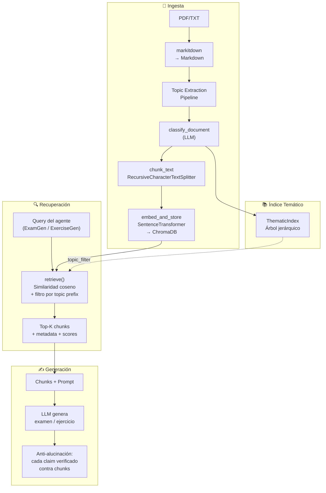
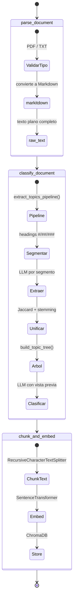
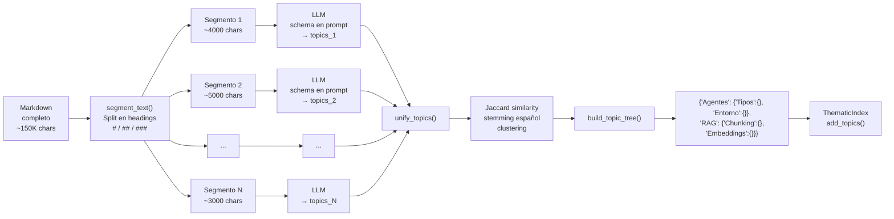
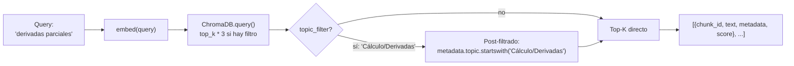
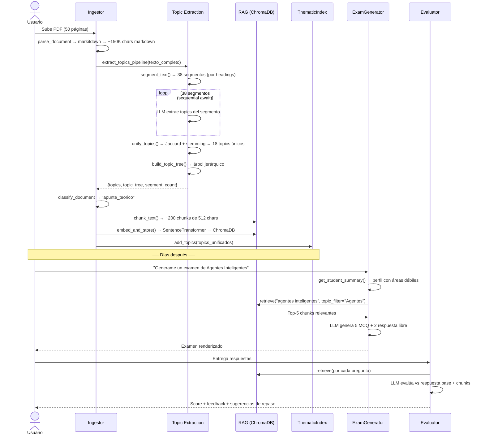

# RAG Pipeline — Tutor Académico Personal

> **⚠️ Mantenimiento:** Si modificás el pipeline de ingesta, el módulo `src/topic_extraction/`, `src/rag/`, o el `ThematicIndex`, actualizá este documento. Referencia: [`AGENTS.md`](./AGENTS.md).

Sistema completo de Retrieval-Augmented Generation para preparación de exámenes universitarios. Ingiere material académico (PDFs, TXT), extrae temas con cobertura completa del documento, genera embeddings y permite búsqueda semántica con filtrado por tema.

---

## Arquitectura General



---

## 1. Pipeline de Ingesta

El grafo de LangGraph del Ingestor ejecuta tres nodos en secuencia lineal:



### 1.1 `parse_document` — Conversión a Markdown

```python
# back/src/agents/ingestor.py:45
# back/src/utils/text.py:68

def parse_document(state):
    file_path = state["file_path"]      # PDF o TXT
    raw_text = parse_file_to_text(file_path)  # markitdown → Markdown
    return {"raw_text": raw_text, "file_type": "pdf|text"}
```

**markitdown** (Microsoft) convierte PDF, DOCX, PPTX, y otros formatos a Markdown estructurado preservando:
- Headings (`#`, `##`, `###`) — **crítico para segmentación por tema**
- Tablas, listas, párrafos
- El texto plano resultante es lo que alimenta todo el pipeline downstream

Formatos aceptados: PDF, TXT. Imágenes (PNG/JPG) rechazadas — OCR diferido.

### 1.2 `classify_document` — Clasificación + Extracción de Temas

```python
# back/src/agents/ingestor.py:94 (async)

async def classify_document(state):
    raw_text = state["raw_text"]  # ~150K chars para PDF de 50 páginas

    # ── NUEVO (Epic 11): pipeline de extracción sobre documento COMPLETO ──
    pipeline_result = await extract_topics_pipeline(raw_text)
    # pipeline_result = {
    #     "summary": "...",
    #     "topics": ["Agentes Inteligentes", "RAG/Chunking", ...],
    #     "topic_tree": '{"Agentes": {"Tipos": {}, "Entorno": {}}, ...}',
    #     "segment_count": 38,
    #     "failed_segments": []
    # }

    # Clasificación tradicional (sigue usando preview de 3000 chars)
    prompt = f"""Clasificá este texto: apunte_teorico, examen_previo, etc.
    Temas detectados en el documento completo: {pipeline_result['topics'][:8]}
    Texto (vista previa): {raw_text[:3000]}
    """
    result = structured_llm.invoke(prompt)
    # → classification, confidence, topics
```

**Antes de Epic 11:** `raw_text[:3000]` → el LLM veía solo 2-3% de un PDF de 50 páginas. Los temas de las páginas 3-50 eran invisibles.

**Después de Epic 11:** La pipeline `extract_topics_pipeline` procesa el documento **completo** por segmentos, luego unifica los temas. La clasificación sigue usando vista previa, pero ahora recibe los temas detectados en todo el documento como contexto.

### 1.3 `chunk_and_embed` — Embeddings en ChromaDB

```python
# back/src/agents/ingestor.py:177

def chunk_and_embed(state):
    chunks = chunk_text(state["raw_text"])       # RecursiveCharacterTextSplitter
    metadatas = [
        {
            "document_id": doc_id,
            "session_id": state["session_id"],
            "classification": state["classification"],
            "source_file": "apunteAgentes_IA2007.pdf",
            "topic": state["topics"][0],          # tema primario
            "topics": state["topics"],             # todos los temas
            "chunk_index": i
        }
        for i in range(len(chunks))
    ]
    embed_and_store(chunks, metadatas, f"session_{session_id}")
```

Cada chunk lleva metadatos que incluyen el tema primario y la lista completa de temas. Esto permite filtrar por tema en la recuperación.

---

## 2. Topic Extraction Pipeline (Epic 11)

Módulo nuevo: `src/topic_extraction/`. Resuelve RF-06 (índice temático debe cubrir TODO el material).



### 2.1 Segmentación — `segment.py`

```python
# back/src/topic_extraction/segment.py

def segment_text(text, min_section=200, max_chars=6000) -> list[str]:
    # 1. Buscar headings markdown: #, ##, ###, ####
    headings = re.finditer(r"^#{1,4}\s+.+$", text, re.MULTILINE)

    if headings:
        # Split en boundaries de headings
        # Merge de secciones adyacentes < min_section chars
        return merged_segments

    # 2. Fallback: sin headings → split por párrafos (\n\n)
    if len(text) <= max_chars:
        return [text]  # passthrough (TXR-10)
    return text.split("\n\n")

    # 3. Texto vacío → []
```

**Por qué headings:** `markitdown` preserva la estructura de headings del PDF. Un apunte típico tiene `# Capítulo`, `## Sección`, `### Tema`. Partir en estos boundaries naturales evita cortar temas a la mitad y produce segmentos semánticamente coherentes para el LLM.

### 2.2 Extracción — `extract.py`

```python
# back/src/topic_extraction/extract.py

async def _extract_segment_topics(segment, llm, segment_index, total):
    schema_json = json.dumps(TopicExtraction.model_json_schema())

    prompt = (
        "Respond with JSON matching this exact schema:\n"
        f"{schema_json}\n\n"
        "No other text. Just valid JSON.\n\n"
        f"Fragmento {segment_index+1}/{total}:\n{segment}"
    )

    response = await llm.ainvoke(prompt)

    # Regex extraction (mismo patrón que _ollama_json_mode_chain)
    json_match = re.search(r"\{[\s\S]*\}", response.content)
    return TopicExtraction.model_validate(json.loads(json_match.group(0))).topics
```

**Sin `with_structured_output()`:** El schema JSON se pasa en el system prompt. El LLM responde con texto libre que incluye el JSON. Se extrae con regex `\{[\s\S]*\}` — mismo approach que `_ollama_json_mode_chain` en `llm.py:45-103`. Funciona con cualquier provider (ollama, opencode-go, groq, openai).

**Secuencial estricto:** Un `await` por segmento. Sin paralelismo — compatible con Ollama Cloud free tier (1 llamada concurrente máxima).

**Graceful degradation:** Si un segmento falla (network error, LLM timeout), se loguea warning, se agrega a `failed_segments`, y se continúa con los demás.

### 2.3 Unificación — `unify.py`

```python
# back/src/topic_extraction/unify.py

def unify_topics(all_topics, threshold=0.6) -> list[str]:
    # 1. Stemming español (Snowball) + remove stopwords
    #    "Agentes inteligentes y su entorno" → {agent, inteligent, entorn}
    #    "El entorno de los agentes inteligentes" → {entorn, agent, inteligent}

    # 2. Jaccard similarity pairwise
    #    sim(A, B) = |A ∩ B| / |A ∪ B|
    #    Si sim ≥ 0.6 → mismo cluster

    # 3. Union-find clustering

    # 4. Canonical name: string más largo del cluster

    # 5. ≤ 30 topics máximo (settings.max_topics_per_document)

    return sorted(unified_topics)
```

**NLP solo en unificación — nunca al LLM:** Pasar texto stemmeado al LLM (`"agnt intelig pued percibir entorn"`) degrada su capacidad de razonar sobre conceptos. El stemming se aplica ÚNICAMENTE para comparar similitud entre topics ya extraídos, no para el input del modelo.

### 2.4 Árbol Jerárquico — `tree.py`

```python
# back/src/topic_extraction/tree.py

async def build_topic_tree(topics) -> dict:
    if len(topics) <= 5:
        # Determinístico: agrupar por primera palabra
        return deterministic_tree(topics)

    # >5 topics: LLM organiza jerárquicamente
    prompt = "Organizá estos temas en un árbol jerárquico..."
    response = await llm.ainvoke(prompt)
    return parse_json(response)

# Output:
# {"Agentes Inteligentes": {"Tipos": {}, "Entorno": {}, "Racionalidad": {}},
#  "RAG": {"Chunking": {}, "Embeddings": {}, "Recuperación": {}}}
```

### 2.5 API Pública

```python
# back/src/topic_extraction/__init__.py

async def extract_topics_pipeline(text: str) -> dict:
    """
    Returns:
        {
            "summary": "Agentes Inteligentes y RAG",
            "topics": ["Agentes Inteligentes/Tipos", "RAG/Chunking", ...],
            "topic_tree": '{"Agentes": {...}, "RAG": {...}}',
            "segment_count": 38,
            "failed_segments": []
        }
    """
```

---

## 3. Chunking y Embeddings

### 3.1 Chunking Semántico

```python
# back/src/rag/__init__.py:71

def chunk_text(text, metadata=None) -> list[Document]:
    splitter = RecursiveCharacterTextSplitter(
        chunk_size=512,        # settings.chunk_size
        chunk_overlap=64,      # settings.chunk_overlap
        separators=["\n\n", "\n", ". ", " ", ""],
    )
    chunks = splitter.split_text(text)
    return [Document(page_content=chunk, metadata={**metadata, "chunk_index": i})
            for i, chunk in enumerate(chunks)]
```

Separadores en orden de prioridad: párrafos → líneas → oraciones → palabras → caracteres. Prioriza boundaries semánticos antes de recurrir a splits arbitrarios.

### 3.2 Embeddings

```python
# back/src/rag/__init__.py:48

def get_embedding_model() -> SentenceTransformer:
    return SentenceTransformer("paraphrase-multilingual-MiniLM-L12-v2")
    # 384 dimensiones, multilingüe (español incluido), local, sin API externa
```

**Modelo local:** `paraphrase-multilingual-MiniLM-L12-v2` — 384 dimensiones, optimizado para similitud semántica multilingüe. Corre 100% local sin llamadas a APIs externas. Caché en disco después de la primera descarga.

### 3.3 Almacenamiento en ChromaDB

```python
# back/src/rag/__init__.py:107

def embed_and_store(chunks, metadatas, collection_name):
    model = get_embedding_model()
    client = get_chroma_client()  # PersistentClient en ./data/chroma

    collection = client.get_or_create_collection(
        name=collection_name,           # "session_{session_id}"
        metadata={"hnsw:space": "cosine"}  # similitud coseno
    )

    embeddings = model.encode(chunks).tolist()
    ids = [str(uuid.uuid4()) for _ in chunks]

    collection.add(ids=ids, embeddings=embeddings, documents=chunks, metadatas=metadatas)
```

- **Colecciones por sesión:** `session_{uuid}` — cada sesión de estudio tiene su propia colección. Ingesta incremental agrega chunks a la misma colección sin reprocesar existentes (RF-03).
- **Embeddings + documentos + metadatos:** ChromaDB guarda los tres. Los metadatos incluyen `topic`, `topics`, `classification`, `source_file`, `chunk_index`.
- **Similitud coseno:** Distancia coseno para búsqueda semántica (`hnsw:space: cosine`).

---

## 4. ThematicIndex — Índice Temático Jerárquico

```python
# back/src/rag/__init__.py:244

class ThematicIndex:
    """Árbol de temas con merge para ingesta incremental."""

    def add_topics(self, topics: list[str]):
        """Inserta paths con / como separador.
        "Agentes/Tipos" → tree["Agentes"]["Tipos"] = {}
        """
        for topic in topics:
            parts = topic.split("/")
            node = self._tree
            for part in parts:
                node = node.setdefault(part, {})

    def merge(self, other: ThematicIndex):
        """Deep-merge de otro árbol. Ramas existentes preservadas."""

    def search(self, topic: str) -> list[str]:
        """Devuelve hijos de un nodo. "Agentes" → ["Tipos", "Entorno"]"""
```

**Integración con la pipeline de Epic 11:** Los topics unificados (lista plana con paths como `"Agentes/Tipos"`) se pasan directamente a `add_topics()`. El merge incremental permite que un segundo PDF agregue sus temas sin perder los del primero.

**Uso en recuperación:** `retrieve(query, topic_filter="Agentes/Tipos")` → solo devuelve chunks cuyo `metadata["topic"]` empieza con `"Agentes/Tipos"` (prefix match). Permite búsqueda acotada por tema.

---

## 5. Recuperación (Read Path)

```python
# back/src/rag/__init__.py:160

def retrieve(query, collection_name, top_k=5, topic_filter=None) -> list[dict]:
    model = get_embedding_model()
    collection = client.get_collection(collection_name)

    # Embedding de la query
    query_embedding = model.encode([query]).tolist()

    # Fetch ampliado si hay topic_filter (post-filtrado)
    fetch_k = top_k * 3 if topic_filter else top_k

    results = collection.query(
        query_embeddings=query_embedding,
        n_results=fetch_k,
        include=["documents", "metadatas", "distances"]
    )

    # Post-filtrado: solo chunks cuyo metadata["topic"] empieza con topic_filter
    for chunk_id, text, meta, dist in zip(ids, docs, metas, dists):
        if topic_filter and not meta.get("topic", "").startswith(topic_filter):
            continue
        output.append({"chunk_id": chunk_id, "text": text, "metadata": meta,
                       "similarity_score": dist})
        if len(output) >= top_k:
            break
```



**Flujo típico en ExamGenerator:**
1. Orchestrator invoca `get_student_summary()` → perfil del estudiante con `weak_topics`
2. ExamGenerator llama `retrieve(query="derivadas", topic_filter="Cálculo/Derivadas", top_k=5)`
3. Arma prompt con los 5 chunks recuperados + instrucciones de generación
4. LLM genera preguntas ancladas en los chunks (guardrail anti-alucinación)

---

## 6. Flujo Completo: de PDF a Examen



---

## 7. Configuración Relevante

```bash
# .env — RAG settings
EMBEDDING_MODEL_NAME=paraphrase-multilingual-MiniLM-L12-v2
CHROMA_PERSIST_DIRECTORY=./data/chroma
CHUNK_SIZE=512
CHUNK_OVERLAP=64
RETRIEVAL_TOP_K=5

# Topic extraction (Epic 11)
TOPIC_SEGMENT_SIZE=6000         # chars máximos por segmento
TOPIC_SIMILARITY_THRESHOLD=0.6  # Jaccard threshold para unificar
MAX_TOPICS_PER_DOCUMENT=30      # cap anti-explosión
TOPIC_MIN_SECTION_CHARS=200     # merge de secciones < 200 chars
```

---

## 8. Guardrails

| Riesgo | Mecanismo | En código |
|--------|-----------|-----------|
| Alucinación en preguntas | Post-generación: verificar cada claim contra chunks con score > threshold | `exam_generator.py` — `validate_exam_claims()` |
| Segmento LLM falla | try/except por segmento, log warning, continúa | `extract.py` — `_extract_segment_topics()` |
| Documento no académico | classify_document rechaza `no_academico` | `ingestor.py:143` |
| Índice inconsistente | LLM-as-judge en Evaluator | `evaluator.py` — `judge_evaluation()` |
| Explosión de topics | `max_topics_per_document=30` | `unify.py` |
| Loop infinito agente | 15 iteraciones máximo por task | `config.py` — `max_iterations_per_task` |

---

## 9. Stack y Dependencias

| Componente | Tecnología | Versión |
|------------|-----------|---------|
| LLM | LangChain + provider configurable | opencode-go / ollama / groq |
| Orquestación | LangGraph | 1.x |
| Vector Store | ChromaDB (PersistentClient) | 0.5+ |
| Embeddings | SentenceTransformer | 3.x |
| Chunking | LangChain RecursiveCharacterTextSplitter | — |
| Parsing PDF | markitdown (Microsoft) | — |
| NLP español | NLTK (stopwords + SnowballStemmer) | 3.9+ |
| Backend | FastAPI | — |
| Tests | pytest + pytest-asyncio | 8.x |
